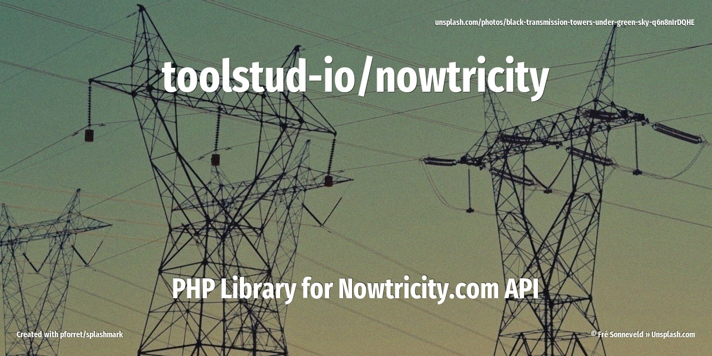

# PHP Library for Nowtricity API

Github: 


Packagist: 
[](https://packagist.org/packages/toolstud-io/nowtricity)
[](https://packagist.org/packages/toolstud-io/nowtricity)



PHP Library for Nowtricity API - based on https://www.nowtricity.com/emissions-api/

## Installation

You can install the package via composer:

```bash
composer require toolstud-io/nowtricity
```

## Usage

``` php
$obj = new ToolstudIo\Nowtricity\Nowtricity($apiKey);
$countries = $obj->countries();
$current = $obj->current('belgium');
$last24 = $obj->last24('belgium');
$year = $obj->year('belgium', '2022');
```

## Testing

``` bash
composer test
```

## Changelog

Please see [CHANGELOG](CHANGELOG.md) for more information on what has changed recently.

## Contributing

Please see [CONTRIBUTING](CONTRIBUTING.md) for details.

## Security

If you discover any security related issues, please email author_email instead of using the issue tracker.

## Credits

- [Peter Forret](https://github.com/toolstud-io)
- [All Contributors](../../contributors)

## License

The MIT License (MIT). Please see [License File](LICENSE.md) for more information.
